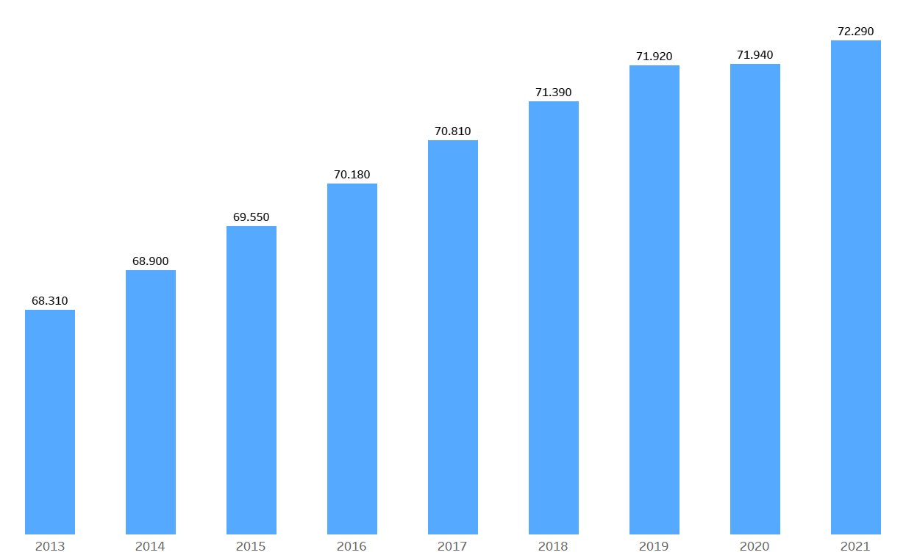
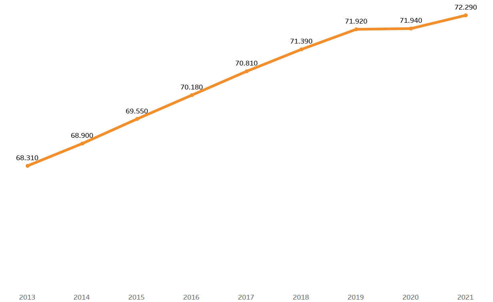
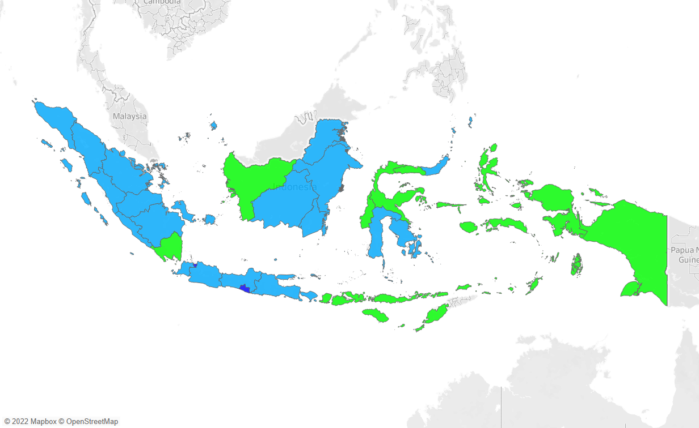

<h1 align="center">
  Implementasi Visualisasi Data Interaktif pada Publikasi Indeks Pembangunan Manusia 
</h1>
<h2 align="center">
  (Indeks Pembangunan Manusia Indonesia Tahun 2021)
</h2>

<h3 align="center"><i>Link</i> akses <i>project</i>: <a href="https://public.tableau.com/app/profile/hardi5401/viz/IndeksPembangunanManusia-Visdat/IPM">Project UAS VISDAT</a></h3>

<h2>Ringkasan Penelitian</h2>
<h3>I. Latar Belakang </h3>
  

  Indeks Pembangunan Manusia (IPM) adalah salah satu ukuran kualitas yang dapat digunakan untuk mengukur sejauh mana kualitas pembangunan manusia yang telah dicapai. Dalam pembangunan manusia terdapat konsep yang luas mengenai seluruh pilihan yang dimiliki oleh manusia pada semua golongan masyarakat pada setiap tahap pembangunan. Publikasi data statistik mengenai Indeks Pembangunan Manusia berupa tabel dan grafik dilakukan oleh Badan Pusat Statistik (BPS) dan dipublikasikan melalui media cetak dan <i>online</i>. 
  

  

  Seiring dengan perkembangan teknologi, penyajian data statistik juga mengalami perkembangan. Data statistik tidak hanya disajikan dalam bentuk tabel dan grafik tetapi juga berupa visualisasi interaktif berbasis <i>online</i> yang memudahkan dalam hal mengakses dan mengeksplorasi data.
  

  

  Berdasarkan uraian tersebut akan dibuat penelitian untuk membuat ulang (<i>redesign</i>) publikasi BPS mengenai Indeks Pembangunan Manusia dengan menggunakan visualisasi data interaktif. Dengan <i>redesign</i> tersebut diharapkan data statistik dapat lebih mudah dipahami dan dapat lebih dieksplorasi oleh pengguna dengan fitur-fitur yang ada dan akan disesuaikan dengan kebutuhan pengguna
  

<h3>II. Tujuan Penelitian</h3>
  

  Berdasarkan uraian pada latar belakang, maka dirumuskan tujuan penelitian yang ingin dicapai, yaitu: 
    <ol type="1">
      <li align="justify">
        Membuat ulang visualisasi data Indeks Pembangunan Manusia (IPM) berdasarkan publikasi yang telah diterbitkan oleh Badan Pusat Statistika (BPS).
      </li>
      <li align="justify">
        Membuat visualisasi data interaktif mengenai Indeks Pembangunan Manusia dengan <i>Tableau Public</i>.
      </li>
    </ol>
  

<h3>III. Metode Penelitian</h3>
  

  <h4>a. Ruang Lingkup Penelitian</h4>
  

  

  Penelitian ini bertujuan untuk membuat ulang visualisasi pada publikasi BPS tentang Indeks Pembangunan Manusia yang dibuat menjadi visualisasi data interaktif. Data yang digunakan adalah data sekunder yang didapatkan dari publikasi pada <i>website</i> BPS yang berupa data spasial dan data panel berupa gabungan antara data runtun waktu dan data lintas daerah. Selain dari data yang diterbitkan oleh BPS, digunakan pula data geometri yang berisi variabel geometri untuk memvisualkan peta tematik sesuai daerah yang akan diinterpretasikan.
  

  

  <h4>b. Studi Literatur</h4>
  

  

  Studi literatur berkenaan dengan metode pengumpulan data Pustaka, membaca dan mencatat, serta mengelola bahan penelitian. Studi literatur dilakukan dengan mempelajari berbagai jurnal ilmiah, buku, dan artikel yang terkait dengan penelitian yang membahas tentang teknik visualisasi data dan publikasi hasil visualisasi data.
  

  

  <h4>c. Pengolahan Data</h4>
  

  

  Pengolahan data dilakukan agar data mentah dapat digunakan dalam penelitian dan diimplementasikan untuk visualisasi data dengan <i>tools</i> yang digunakan. Tahapan pengolahan data meliputi pencarian data, pengumpulan data, pemeriksaan data, pemilihan data, pembersihan data, peringkasan data, dan penyatuan data. <i>Tools</i> yang digunakan untuk membantu pengolahan data adalah <i>Microsoft Office Excel</i> dan <i>R-Studio</i>.
  

    

  <h4>d. Visualisasi Data</h4>
  

  

  Data yang sudah diolah akan dilakukan visualisasi sesuai dengan jenis visualisasi yang paling sesuai. <i>Tools</i> yang digunakan dalam pembuatan visualisasi data ini adalah <i>Figma</i> dan <i>Tableau Public</i>. Beberapa jenis visualisasi yang akan diimplementasikan pada data adalah <i>bar chart</i>, <i>line chart</i>, dan <i>interactive choropleth map</i>. 
  

<h3>IV. Hasil dan Pembahasan</h3>
  

  <h4>a. Visualisasi Data</h4>
  

  

  Visualisasi data digunakan untuk merepresentasikan data statistik secara visual. Memvisualisasikan data dapat membantu pengguna untuk lebih memahami pola, tren, hubungan, dan pencilan yang terdapat dalam data yang besar dan kompleks. Beberapa jenis visualisasi data yang popular digunakan adalah <i>bar chart</i>, <i>line chart</i>, maupun <i>pie chart</i>.
  

  

  Visualisasi data interaktif didefinisikan sebagai visualisasi data yang interaktif dimana pengguna dapat melakukan interaksi seperti <i>overview</i>, <i>zoom</i> dan <i>filtering</i>, hingga <i>details on demand</i>. Visualisasi data interaktif mendukung pengguna untuk menggali informasi lebih mendalam mengenai data dan menampilkan berbagai macam tampilan data secara bergantian sesuai keinginan pengguna.
  

  

  <h4>b. Implementasi Visualisasi Data</h4>
  

  <ol type="1">
    <li>
      <h5><i>Bar Chart</i></h5>
    </li>
     </img>
    <li>
      <h5><i>Line Chart</i></h5>
    </li>
     </img>
    <li>
      <h5><i>Choropleth Map</i></h5>
    </li>
     </img>
  </ol>

<h3>V. Kesimpulan dan Saran</h3>
  

  Pada penelitian ini telah berhasil mengimplementasikan visualisasi data pada data Indeks Pembangunan Manusia dengan tiga jenis visualisasi data berupa <i>bar chart</i>, <i>line chart</i>, dan <i>interactive choropleth map</i>. Pengaplikasian data visual dirasa cukup karena sesuai dengan publikasi yang dilakukan oleh Badan Pusat Statistika (BPS) yang diimplementasikan menjadi publikasi online dan peta interaktif. Dari visualisasi yang telah dibuat dapat disimpulkan bahwa kelebihan publikasi yang dilakukan dengan visualisasi data interaktif akan berisi informasi yang lebih banyak dan beragam, pengguna juga dapat mengeksplorasi data lebih mendalam sesuai dengan informasi yang ingin didapatkan.
  

  

  Selain itu, terdapat pula beberapa kekurangan dalam penelitian ini seperti keterbatasan data dan <i>tools</i> yang digunakan. Penggunaan <i>Tableau Public</i> cukup baik dalam memvisualisasikan data tetapi kurang baik digunakan secara online karena terasa sangat berat dan kurang responsif.

  

  Saran untuk penelitian selanjutnya adalah dengan memperbanyak variasi data agar visualisasi data yang dilakukan lebih beragam. Dibutuhkan pula tools yang lebih mumpuni agar mempermudah dalam melakukan visualisasi data dan mengakses data hasil visualisasi agar lebih optimal.
  

